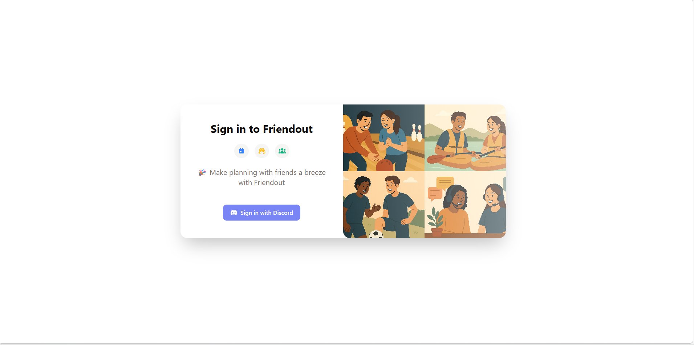
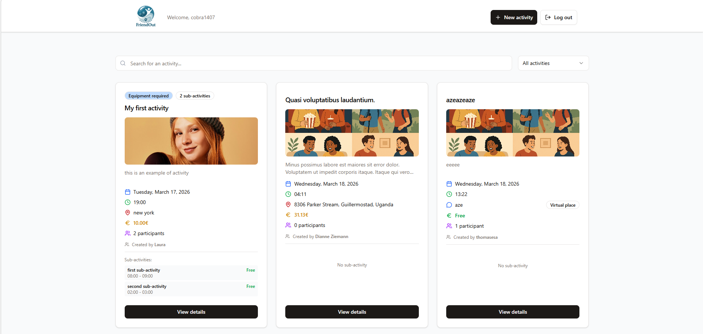
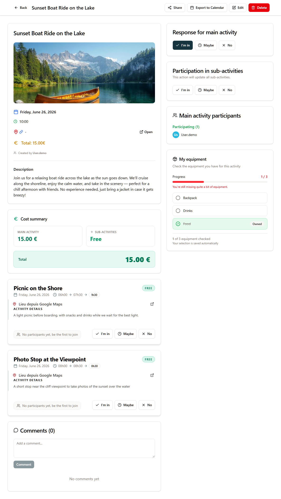
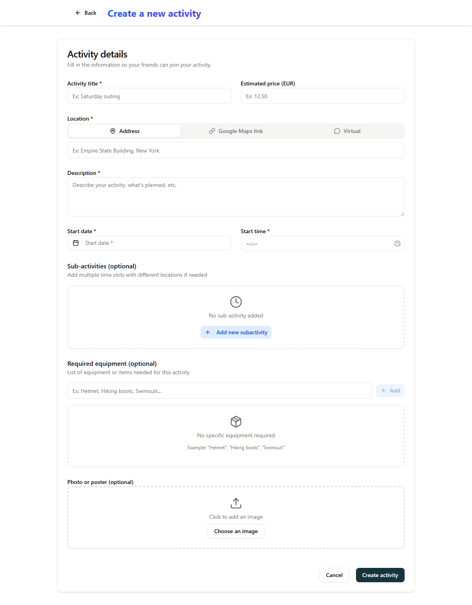
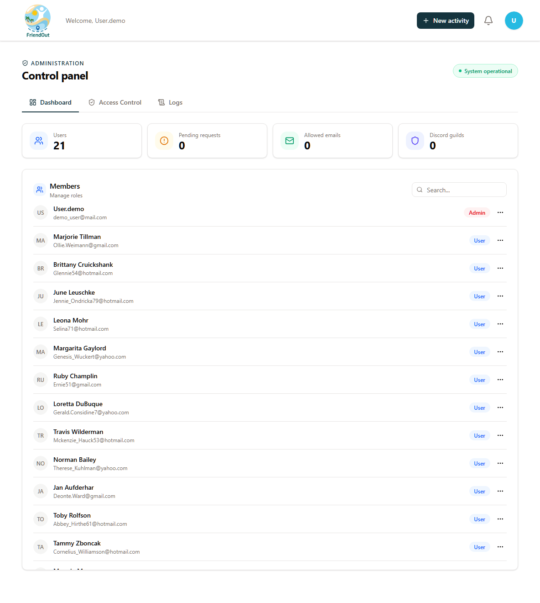

# Friendout

> An app to organize activities with your friends — hassle-free.

> ⚠️ **Work in Progress (WIP)** — some features may be incomplete or subject to change.

---

*[Lire en Français](README.md)*

---

## 📸 Preview






---

## 🙋 About this project

I'm a **junior developer** and Friendout is my first real fullstack project built from scratch.

The idea came from a very concrete need: with my friend group on Discord, we always wanted to organize activities together — games, outings, hangouts — and it always ended up in a mess of messages. Who's available? Who wants to join? Which day? Friendout is my answer to that problem.

I'm sharing this code as open source because I've learned a lot myself by reading other developers' code. I hope this project can help someone else in their learning journey. Feedback and constructive criticism are very welcome — that's how we grow.

---

## 🎯 What is Friendout?

**Friendout** is a web application to **create and join activities with friends**. Authentication is handled via **Discord OAuth** or **Google OAuth** — no password, no sign-up form.

In practice, you can:
- Create an activity (game, outing, event...) with a date and description
- Let members of a Discord server join it
- Manage your participations from a simple, fast interface

---

## 🛠️ Tech Stack

| Layer | Technology |
|---|---|
| Frontend | React 19, TypeScript, Vite 7, Tailwind CSS 4, shadcn/ui |
| Backend | ASP.NET Core 9 (C#), Entity Framework Core 9 |
| Database | MySQL 8.4 |
| Auth | Discord OAuth 2.0, Google OAuth 2.0 + JWT |
| Infrastructure | Docker + Docker Compose, Nginx |

---

## 🚀 Getting Started

### Prerequisites

- [Docker](https://www.docker.com/) & Docker Compose
- A [Discord application](https://discord.com/developers/applications) (Client ID + Secret)

### 1. Clone the repository

```bash
git clone https://github.com/your-username/friendout.git
cd friendout
```

### 2. Set up environment variables

```bash
cp .env.example .env
```

Edit `.env` and fill in all required values (Discord credentials, JWT key, DB passwords).

### 3. Run with Docker

```bash
docker compose up -d --build
```

The app will be available at `http://localhost`.

---

## 💻 Local Development (without Docker)

### Backend

```bash
cd friendout-backend/Friendout.API
cp .env.example .env
# Fill in your local values in .env
dotnet run
```

API available at `http://localhost:5122`. Swagger UI at `http://localhost:5122/swagger`.

### Frontend

```bash
cd friendout-frontend
cp .env.example .env
# Fill in your local values in .env
pnpm install
pnpm dev
```

App available at `http://localhost:5173`.

---

## 📁 Project Structure

```
friendout/
├── docker-compose.yml
├── .env.example                 # Docker environment template
├── friendout-backend/           # ASP.NET Core 9 API
│   ├── Friendout.API/           # Controllers, config, entry point
│   ├── Friendout.Domain/        # Entities, DbContext, seeds
│   ├── Friendout.Infrastructure/# Services, repositories
│   └── Friendout.Tests/         # Unit & integration tests
└── friendout-frontend/          # React + Vite SPA
    └── src/
        ├── components/          # Shared UI components
        ├── features/            # Domain-based feature modules
        ├── contexts/            # React contexts
        ├── i18n/                # FR/EN translations
        └── lib/                 # API client, utils, helpers
```

---

## 🔒 Security & Authentication

Friendout uses a two-layer authentication system:

| Mechanism | Lifetime | Role |
|---|---|---|
| **Access Token (JWT)** | 15 minutes | Authenticates each API request |
| **Refresh Token** | 30 days | Silently renews the access token |

**How it works in practice:**
- On Discord login, two `HttpOnly` cookies are issued — invisible to JavaScript (XSS protection)
- When the access token expires, the frontend automatically renews the session without logging the user out
- Refresh tokens are **single-use** (rotation) — a stolen token becomes invalid as soon as the real user uses it
- On logout, the access token is blacklisted and the refresh token is revoked in the database
- Cookies use `SameSite=Lax` — CSRF protection with no extra configuration

---

## 🔧 OAuth Setup

### Discord

1. Go to the [Discord Developer Portal](https://discord.com/developers/applications)
2. Create a new application
3. Under **OAuth2 → Redirects**, add the URI matching your context:

   | Context | Redirect URI to add |
   |---|---|
   | **Docker (local)** | `http://localhost/api/auth/callback/discord` |
   | **Local development (without Docker)** | `http://localhost:5122/signin-discord` |

   > You can add both at once to cover both scenarios.

4. Copy the **Client ID** and **Client Secret** into your `.env`

### Google

1. Go to the [Google Cloud Console](https://console.cloud.google.com/apis/credentials)
2. Create an **OAuth 2.0 Client ID** (Web application type)
3. Under **Authorized redirect URIs**, add the URI matching your context:

   | Context | Redirect URI to add |
   |---|---|
   | **Docker (local)** | `http://localhost/api/auth/callback/google` |
   | **Local development (without Docker)** | `http://localhost:5122/signin-google` |

4. Copy the **Client ID** and **Client Secret** into your `.env`

> Only whitelisted emails (stored in the database) can sign in via Google. Anyone not on the list can submit an access request from the login page.

---

## 🔑 Environment Variables

### Backend (`friendout-backend/Friendout.API/.env`)

| Variable | Description |
|---|---|
| `ConnectionStrings__FriendoutDatabase` | MySQL connection string |
| `Authentication__Discord__ClientId` | Discord OAuth Client ID |
| `Authentication__Discord__ClientSecret` | Discord OAuth Client Secret |
| `Authentication__Google__ClientId` | Google OAuth Client ID |
| `Authentication__Google__ClientSecret` | Google OAuth Client Secret |
| `Jwt__Key` | JWT signing key (min. 32 characters) |
| `Jwt__Issuer` | Token issuer URL |
| `Jwt__Audience` | Token audience URL |

### Frontend (`friendout-frontend/.env`)

| Variable | Description |
|---|---|
| `VITE_API_BASE_URL` | Backend API base URL |
| `VITE_DISCORD_AUTH_URL` | Discord OAuth entry point |
| `VITE_ENV` | Environment (`development` / `production`) |

---

## 🤝 Contributing

Issues and pull requests are welcome! This is primarily a learning project, so don't hesitate to point out mistakes or suggest improvements.

1. Fork the repository
2. Create a branch: `git checkout -b feature/my-feature`
3. Commit your changes: `git commit -m "feat: add my feature"`
4. Push and open a Pull Request

---

## 📄 License

This project is licensed under the [GPLv2](LICENSE).
